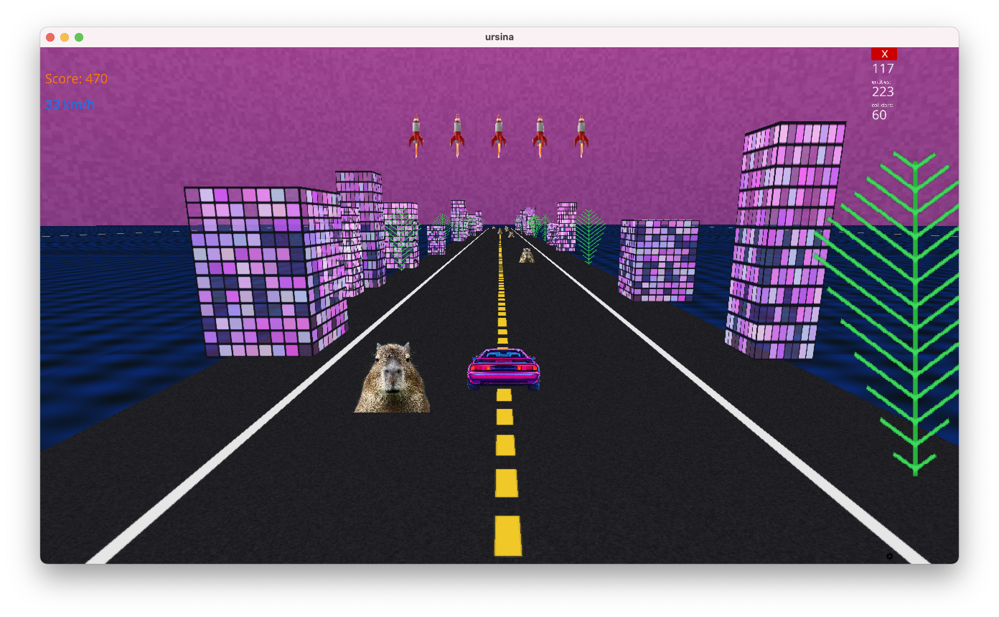

# Miami Racer: Turbo Neon

An over-the-top neon arcade racer built with Ursina. Dodge obstacles, blast them with missiles, hit nitro for warp-speed, and vibe to a retro soundtrack. Includes dynamic neon visuals, pooled SFX, soundtrack loop, and fast arcade handling.

## Features

- Nitro toggle with a visible top-speed boost, camera FOV surge, and engine pitch whine.
- Missile system with 5 ammo icons that regenerate over time (faster at higher speed).
- Crash explosions with sprite and sound.
- Background soundtrack, pooled SFX (missile/explosion), and speed-reactive engine loop.
- Robust HUD initialization and asset fallbacks to avoid black/white screens.

## Quick start

Follow these steps to set up a virtual environment, install dependencies from requirements.txt, and run the game.

### Windows

1. Create a virtual environment

`py -3 -m venv .venv`

2. Activate the environment

`.venv\Scripts\activate`

3. Install dependencies

`pip install --upgrade pip`
`pip install -r requirements.txt`

4. Run the game

`python main.py`

### macOS/Linux

1. Create a virtual environment

`python3 -m venv .venv`

2. Activate the environment

`source .venv/bin/activate`

3. Install dependencies

`pip install --upgrade pip`
`pip install -r requirements.txt`

4. Run the game

`python main.py`

## Controls

- A / Left Arrow: Move left between lanes
- D / Right Arrow: Move right between lanes
- W / S: Throttle up / down
- N: Toggle nitro (speed boost, FOV surge, extra engine pitch)
- M: Fire missile (consumes one ammo; a missile icon reappears when it regenerates)
- Space: Start / Pause; after crash, press Space to retry
- Esc: Quit

## Notes

- Build entirely with AI (GPT-5).
- Built using Ursina (Python game engine).
